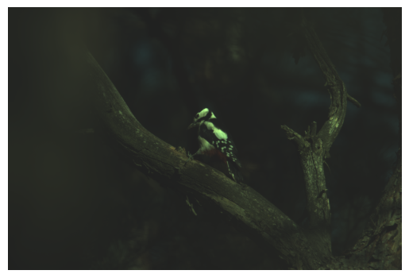

# Demosaicing & HDR Project

This repository contains a Python project focused on demosaicing and High Dynamic Range (HDR) processing of images, inspired by the exercises provided by Florian Kordon, Thomas Köhler, Vincent Christlein, Mathias Seuret, and Mathias Zinnen. The project implements algorithms for investigating Bayer patterns, proving sensor data linearity, demosaicing, improving luminosity, white balancing, and initial HDR implementation including the iCAM06 method.



## Project Overview

The goal of this project was to explore and implement algorithms for processing raw image data, specifically focusing on:

- **Investigating Bayer Patterns**: Understanding the arrangement and functioning of the Bayer filter.
- **Sensor Data Linearity**: Demonstrating the linear relationship between exposure time and sensor data.
- **Demosaicing Algorithm**: Implementing both basic and advanced demosaicing algorithms to convert raw sensor data into a color image.
- **Luminosity Improvement**: Applying gamma correction to enhance the image brightness and contrast.
- **White Balance**: Implementing the gray world assumption for color correction.
- **HDR Implementation**: Creating High Dynamic Range images by combining multiple exposures using the initial HDR techniques and the iCAM06 method.

## Setup and Requirements

This project is implemented in Python and requires the following libraries:

- NumPy
- RawPy (for reading raw images)
- OpenCV (optional, for advanced image processing functions)

To install the necessary libraries, you can use pip:

```bash
pip install numpy rawpy opencv-python
```

## Usage

To use this project, you will need raw image files in CR3 format for processing. The main script `process_raw.py` can be used to apply demosaicing, improve luminosity, apply white balance, and generate HDR images. The script usage is as follows:

```bash
python process_raw.py <path_to_raw_image> <output_path_for_jpg>
```

Replace `<path_to_raw_image>` with the path to your raw image file and `<output_path_for_jpg>` with the path where the processed JPEG image should be saved. 


## Acknowledgments

Special thanks to Florian Kordon, Thomas Köhler, Vincent Christlein, Mathias Seuret, and Mathias Zinnen for providing the exercises and data that inspired this project.
