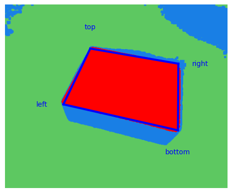
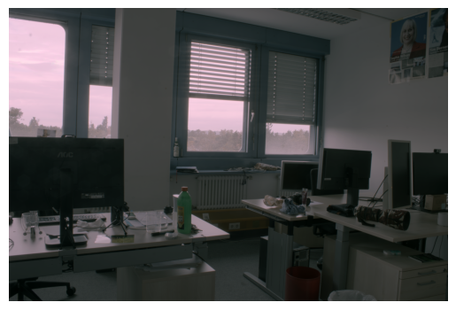

# Computer Vision Project Collection - Winter Term 2023/24

This repository encompasses five distinct projects, each exploring different aspects and techniques within the field of computer vision.

## Projects Overview

Each sub-project within this repository is designed to tackle a unique challenge in computer vision, ranging from image processing and enhancement to object detection and recognition.

<p float="left">
   <!-- Adjust width as needed -->
   <!-- Adjust width as needed -->
   <!-- Adjust width as needed -->
   <!-- Adjust width as needed -->
</p>


### 1. Image Demosaicing and HDR

- **Description**: Focuses on implementing algorithms for demosaicing images and enhancing them using High Dynamic Range (HDR) techniques.
- [Read More](Demosaicing_HDR/README.md)

### 2. Face Recognition

- **Description**: Develops a system capable of recognizing and re-identifying faces within video streams, leveraging both supervised and unsupervised learning methods.
- [Read More](Face_Recognition/README.md)

### 3. Object Detection

- **Description**: Implements the selective search algorithm for object detection, coupled with a pipeline for recognizing objects within images.
- [Read More](Object_Detection/README.md)

### 4. Writer Retrieval

- **Description**: Creates a system for writer identification and retrieval, analyzing handwriting samples to match writers.
- [Read More](Writer_Identification/README.md)

### 5. Box Detection

- **Description**: Estimates the size of a box from distance images using RANSAC for robust plane fitting, addressing challenges in noise sensitivity and measurement accuracy.
- [Read More](Box_Detection/README.md)

## Getting Started

To begin exploring these projects, clone this repository to your local machine:

```bash
git clone <repository-url>
```

Navigate into each project's directory to find specific instructions on installation, dependencies, and usage.

## Dependencies

The projects may have varying dependencies, primarily including libraries such as `numpy`, `scipy`, `matplotlib`, `scikit-learn`, and `opencv-python`. Ensure to check the `requirements.txt` file within each project's directory and install necessary packages:

```bash
pip install -r requirements.txt
```

## Contributions

Contributions across any of the sub-projects are highly encouraged. Please refer to the specific guidelines in the respective project's README for more details on contributing.

